# Creating a Chat Control with UI5 (OpenUI5) Using TypeScript

This tutorial will guide you through setting up a development environment to create a simple chat application with UI5 (OpenUI5 / TypeScript)

## Prerequisites

Before proceeding, ensure you have:

- **Basic understanding of the command-line interface (CLI)**
- **Node.js installed** (this tutorial was writing with v22.11.0)
- **NPM** package manager which usually installing with node.js
- **Git** you need it for download repository
- **Basic knowledge of SAP UI5 and approuter**

First, download the repository with the basic structure and configurations:

Repository URL: [https://github.com/SAP-samples/project-agent-builder-samples](https://github.com/SAP-samples/project-agent-builder-samples)

You need folder **minimal-ui5-chat-connected-to-instance**. I recommend you extract project to separate folder to avoid conflict with git and packages. 

---

## Step 1: Install Dependencies

Next, install all necessary dependencies. Run the following commands in the root folder (it should contain approuter and webapp folders):

```bash
npm install
```

and the `approuter` folder:

```bash
cd approuter
npm install
```

---

## Step 2: Add an Instance of AgentBuilder in Cloud Foundry

Before proceeding, ensure you have access to the **SAP BTP Cockpit** and a valid **BTP account**. You should also have access to the **subaccount** and **space** where the instance will be created.

1. **Log in to your SAP BTP Cockpit**  
   Navigate to your **subaccount** and then to your **space** (e.g., `default`).


2. **Access the Service and Marketplace**  
   Open the **Service and Marketplace** section in the SAP BTP Cockpit and locate **"Project Agent Builder"**.

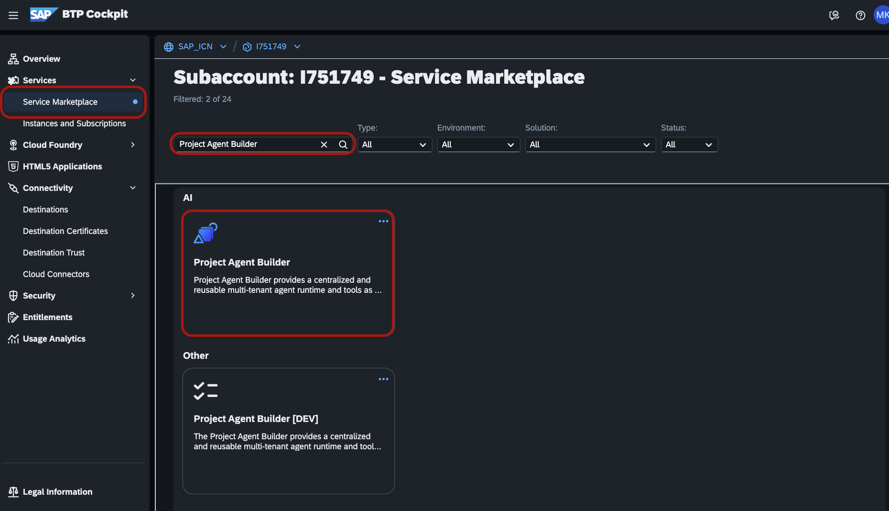

3. **Create an Instance**  
   - Select **"Project Agent Builder"**.  
   - Click **Create**.  
   - Choose the **default instance plan** and provide an instance name.

   Once the instance is created, it will be ready for further configuration and use.

---

## Step 3: Build and Package the Application

1. **Build the Application**  
   In the root folder, run:

   ```bash
   npm run build
   ```

2. **Package the Application**  
   Create an `.mtar` package using the following command:

   ```bash
   mbt build -t gen --mtar mta.tar
   ```
   (perhaps you need mbt install first)
---

## Step 4: Deploy to Cloud Foundry

1. **Log in to Cloud Foundry**  
   Use the following command, replacing the URL with your tenant server address:

   First find url which allow you to connect to cf (cloud foundry)

   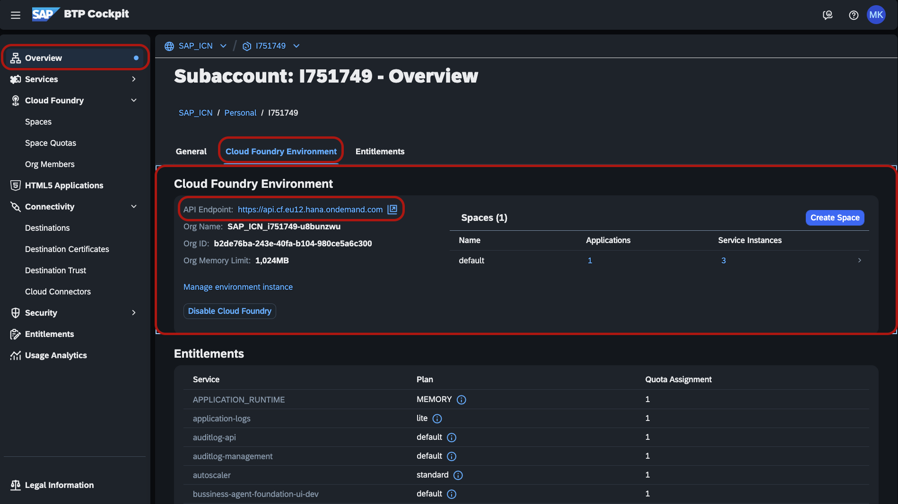

   ```bash
   cf login -a https://api.cf.euXX.hana.ondemand.com --sso
   ```
   Select the correct subaccount and space where you want to deploy

   Enter the Temporary Authentication Code in the console to complete the login.

2. **Deploy the Application**  
   Run the deployment command:

   ```bash
   cf bg-deploy gen/mta.tar --no-confirm
   ```

   During deployment:
   - An `xsuaa` instance will be created and bound automatically based on the `my-xsuaa` resource in `mta.yaml`.
   - A `destination` service will also be created and bound automatically, as described in `mta.yaml` (e.g., `my-destination-service`).

---

## Step 5: Configure Destination Service

   At this point, deployment will not work yet because the `destination` configuration is missing. 
   A destination is stored in the SAP destinations service and contains the connection details for the communication partner. It allows you to read and manage the address of a remote service and the user authentication information for the connection on subaccount and service instance levels

   Follow these steps to complete the setup:

1. **Create a Service Key for AgentBuilder**  
   Go to the **Project Agent Builder** instance (we created it at step 2) and create a **Service Key**. 
   
   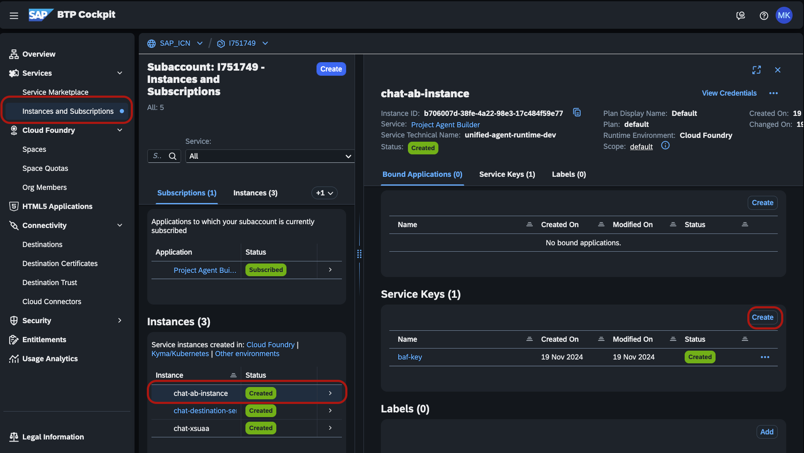
   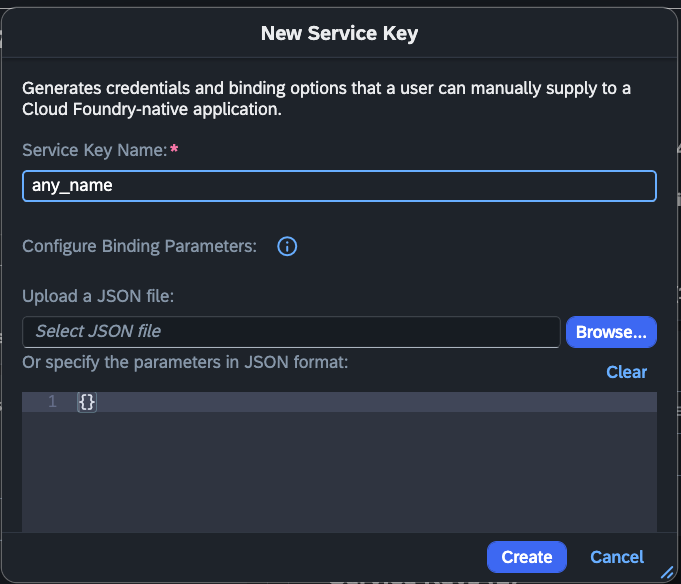

   Key was generated automatically, click on key name or select 'view' from burger menu

   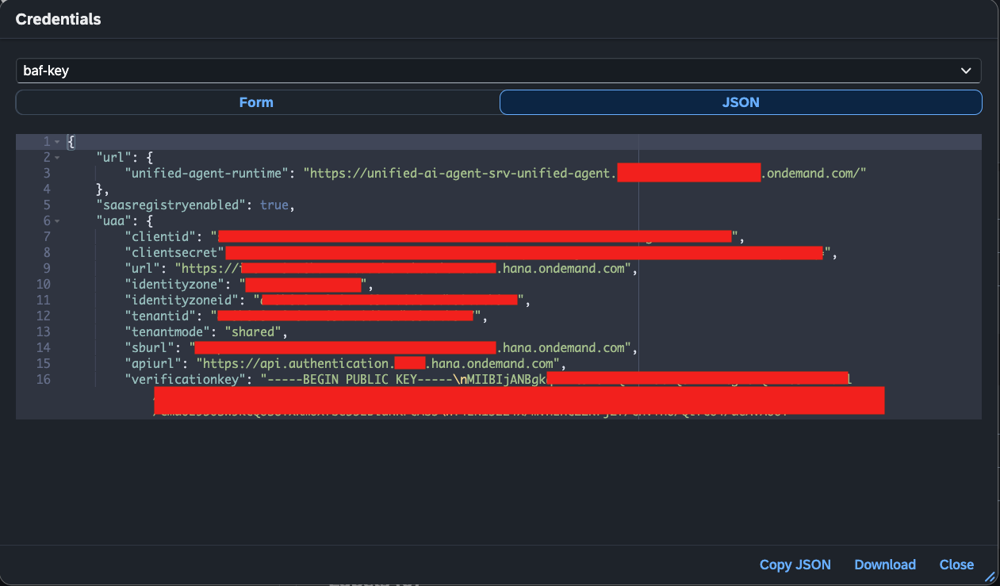

   Copy configuration in some safe place (we will need them in next step) or open cockpit in new tab

2. **Add a Destination**  
   Navigate to the **subaccount level** in the BTP Cockpit:  
   - Go to **Connectivity > Destinations**.

   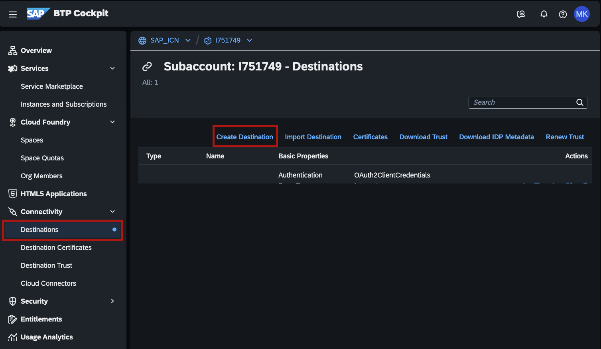

   - Add a new destination with the name `AgentBuilder` and populate the fields as follows:

     - **Name**: `AgentBuilder` (this name important, it should be the same as one of rout destination at xs-app.json)
     - **Type**: `HTTP`
     - **URL**: `https://some-adress.stage.kyma.ondemand.com/api/v1` (copy from > url.unified-agent-runtime from previous saved configuration + /api/v1)
     - **Authentication**: `OAuth2ClientCredentials`
     - **Token Service URL**: `https://some-adress.authentication.euXX.hana.ondemand.com/oauth/token` (copy from > uaa.url from previous saved configuration + /oauth/token)
     - **Client ID**: *(from your Agent Builder service key)*
     - **Client Secret**: *(from your Agent Builder service key)*

   - Ensure all the required fields are correctly populated based on the details from the Agent Builder service key.

   in the end it should looks like that 

   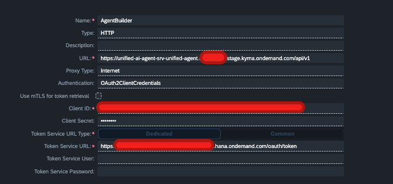

   After completing the setup, click the **"Check Connection"** button.

   - If the configuration is correct, you should see the following message:  
     **"Connection to 'AgentBuilder' established. Response returned: '401: Unauthorized'"**

   This indicates that the connection is successfully established but requires proper authentication credentials to access the API.

   Now when we have new 'Destination' we need to update our application, you can access as described below:

   - First navigate to space tab from your subaccount 

   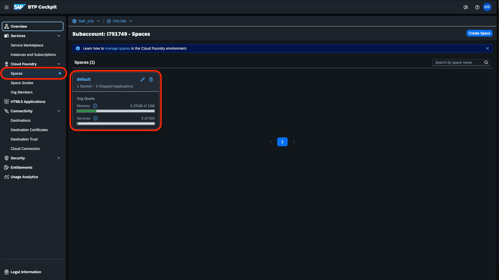

   - After select your application from applications tab

   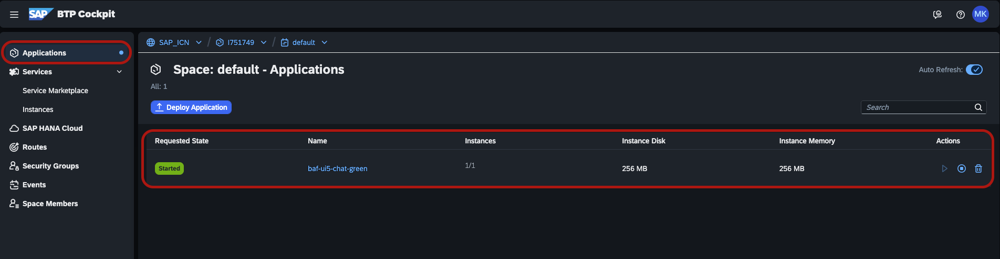

   - And click restart button

   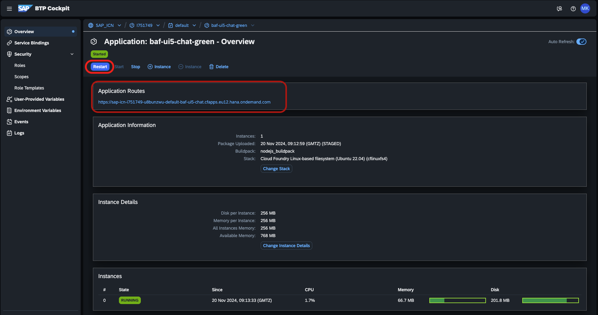

   - At this moment application should be successful running, copy url from previous picture. you will need it for test in next step.
   

3. **Verify the OData Metadata**  
   Test the setup by accessing the metadata URL, use URL from previous step. Build url according template bellow:

   ```bash
   {copiedURL}/odata/unified-ai-service/$metadata
   ```

   It should be like this one:

   ```bash
   https://<tenant-and-app-name>.cfapps.euXX.hana.ondemand.com/odata/unified-ai-service/$metadata
   ```
   If everything wright, the metadata will be displayed.

---

## Step 6: Create Subscriptions and Test the Application

   Don't forget that we don't have any Agents or Chats in our Agent Builder instance right now. This UI tutorial doesn't have functionality for create it, only for viewing,
   that's why we need subscription UI for managed everything. 

1. **Enable the Classic UI**  
   Open the **BTP Cockpit** at the subaccount level, navigate to **Instances and Subscriptions**, and click **Create**.  
   - Find **Project Agent Builder** and add it as a subscription.  

   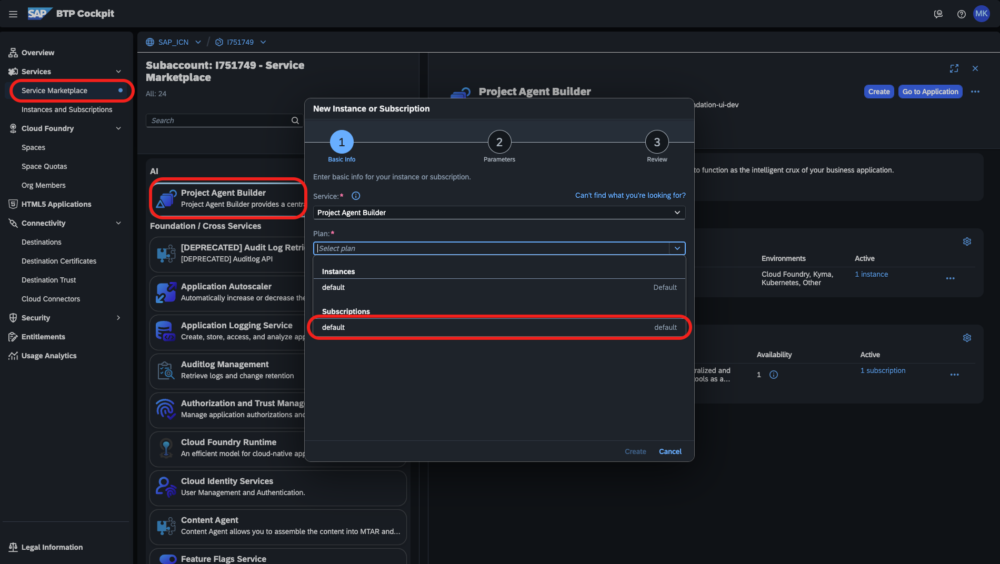

   - This will provide access to the classic UI where you can create agents, tools, and chats.

   - Now you can open application from subaccount page

   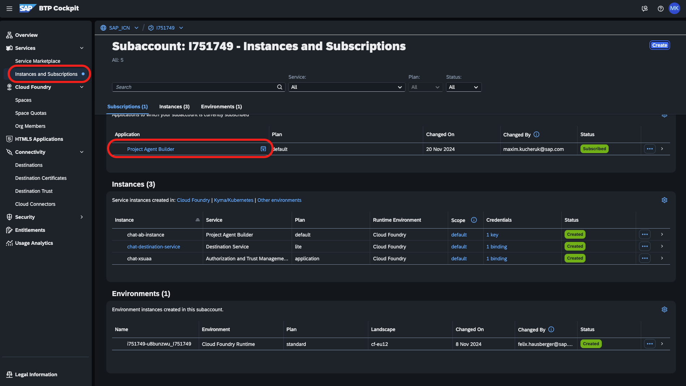

   - Now we need to create Agent, choose any name, left rest of fields as they are and click create

   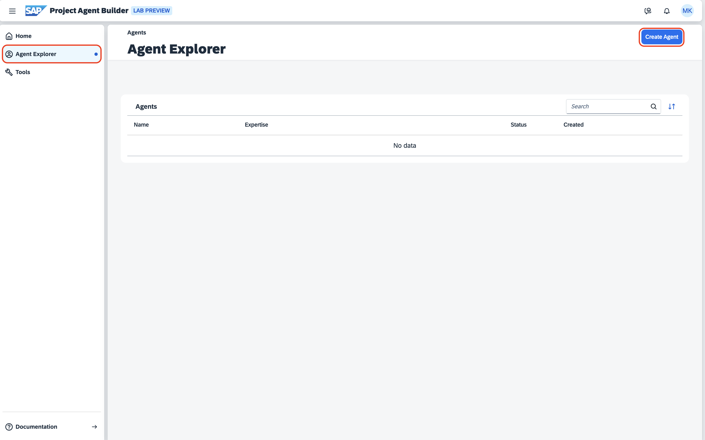
   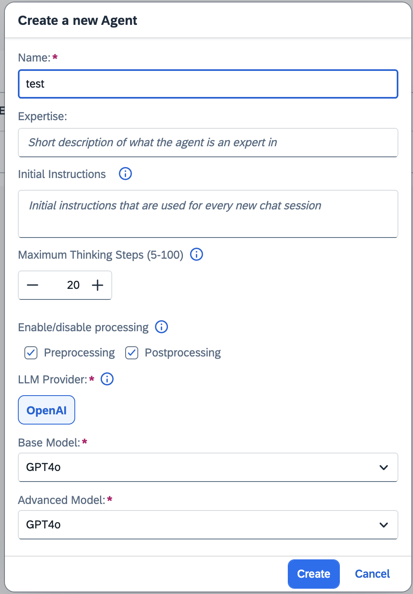

   - after Agent was created you will redirect to Agent page, here you need to start chat

   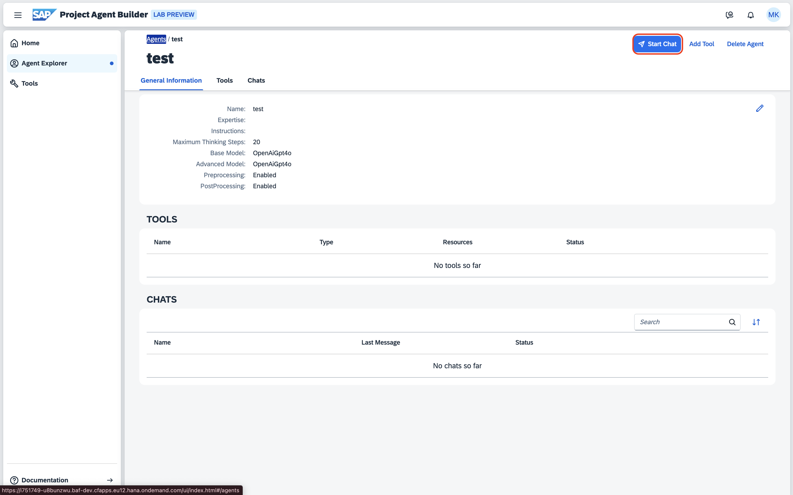

   - Ask bot something for add some history, it will simplify recognizing content in future.
   - Now we need to copy highlighted ids (agent and chat id) for use them for building url for our chat ui,
   it should be like that: 
   b7b1066e-7455-4581-ab01-e1e70ef08383/chats/aa0cd219-c03c-4ad7-8267-64e02f1ccad8
   
   - you need to remove 'chats'. final result should be like:
    b7b1066e-7455-4581-ab01-e1e70ef08383/aa0cd219-c03c-4ad7-8267-64e02f1ccad8
   

2. **Access the Chat UI**  
   This repository includes a UI for a single chat messaging app. Now we have id for create route to the chat. 

   Open the chat UI by accessing the app URL and adding the specific `AgentID` and `chatId` to the path:

   - Get url from app page in our 'space'

   

   - And put id's according this pattern: 

   ```bash
   https://<your-full-domain-and-app-address>/ui/#/chat/{AgentId}/{ChatId}
   ```

   It should be like this:

   ```bash
   https://<your-full-domain-and-app-address>/ui/#/chat/b7b1066e-7455-4581-ab01-e1e70ef08383/aa0cd219-c03c-4ad7-8267-64e02f1ccad8
   ```

   - At this stage, your instance of AgentBuilder should be ready for use with your custom UI. if you will put this url to the browser, you should see your simple chat ui:

   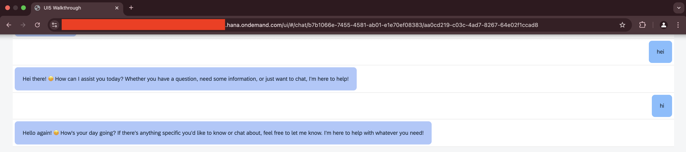
---


